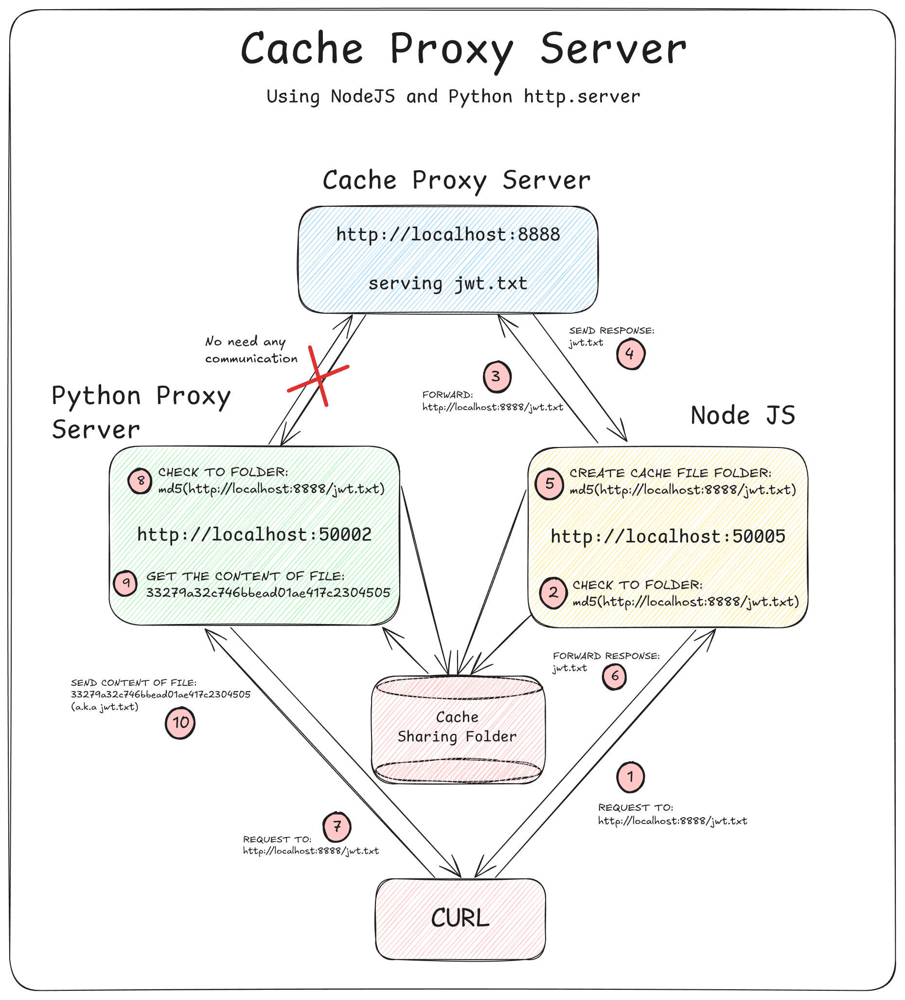

# Caching Proxy

Implementation of proxy server in both Node.js and Python, with a shared caching mechanism. The cache is stored as files named using the MD5 hash of the requested URL, allowing both proxy servers to access and reuse the same cached responses. This setup is designed as a learning project to understand the fundamentals of proxy servers, caching, and simple backend concepts.

Inspired by: https://roadmap.sh/projects/caching-server



## Run Locally

Move to ```/py``` folder and run the code
```bash
  cd /py
  python3 cache-proxy.py
```

Leave the terminal running, open another terminal and move to ```/node``` folder
```bash
  cd ../node
  npm install
```
Run the server
```bash
  node index.js
```
- Python proxy server running on port 50002 by default
- Node proxy server running on port 50005 by default

Serve a simple http server using python3 in ```/example``` folder
```bash
  cd ../example
  python3 -m http.server 8888
```

## Usage/Examples

### USING NODE JS AS PROXY SERVER

Make a request through the Node.js proxy:

```bash
  curl -x http://127.0.0.1:50005 http://localhost:8888/jwt.txt
```
- The request are forwarded to http://localhost:8888/
- A new file will be created in the ```/cache``` folder.

Make the same request again:
```bash
  curl -x http://127.0.0.1:50005 http://localhost:8888/jwt.txt
```
- Check the logs.
- The response should now come from the cache, marked by:

```bash
  [CACHED HIT] http://localhost:8888/out.txt
  [GETTING FILE] -> c051c3f271b12c0890323bebad91e666
```

### USING PYTHON AS PROXY SERVER

Make a request through the Python proxy:

```bash
  curl -x http://127.0.0.1:50002 http://localhost:8888/jwt.txt
```

- Even on the first request, the proxy will use the cached file created earlier by the Node.js proxy:
```bash
   [CACHED HIT] http://localhost:8888/jwt.txt

```
This demonstrates that both proxy servers share the same cache storage.