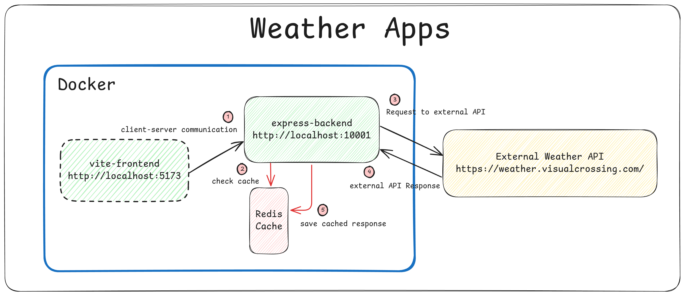
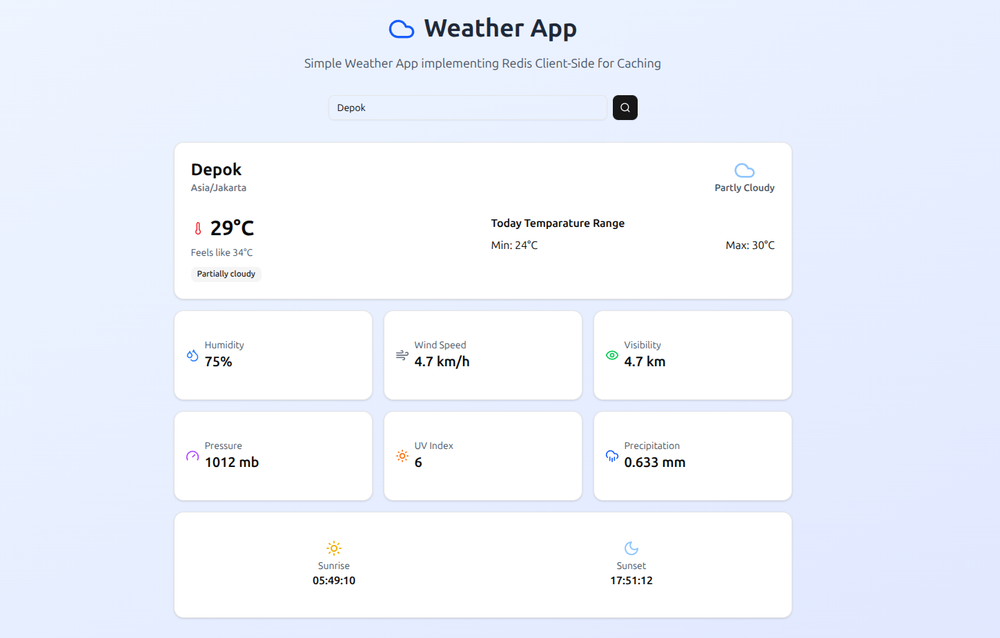

# Weather App

This is a full-stack weather application built with a strong focus on the backend using express.js and caching management using Redis. The frontend are fully generated with the help of AI (thanks to Manus AI).

All services are containerized with Docker, so you can run the entire project locally with a single command.

Inspired by: https://roadmap.sh/projects/weather-api-wrapper-service

*To run this project, you’ll need an API key in the ```.env``` file.
You can contact me if you’d like to use mine, or you can sign up for a free account on the official website to get your own API key.



## Run Locally

Move to root folder and run this command:
```bash
  docker-compose up --build
```
By default
- ```express-backend``` run on port 10001
- ```vite-frontend run``` on port 5173
- ```redis``` run on port 6379

## Preview



